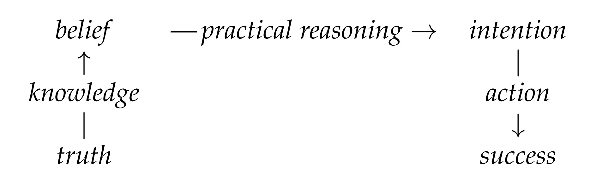

## Knowledge
**Analogies between knowledge and action**

*(January 2025): This is a rewrite of my first essay for Knowledge & Reality with Daniel Kodsi, who (re)taught me that tutorial essays are a genre with particular conventions.*

Williamson (2000, 2017) articulates an analogy on which knowledge stands to belief as (intentional) action stands to intention.[^1] For instance, belief [intention] plays the local role of knowledge [action] as a premise [conclusion] of practical reasoning. I show that there is also an analogy on which knowledge stands to belief as action stands to success. For instance, to know [act], one’s belief [success] cannot be nearly false [unintended]. I argue that the two analogies are complementary theoretical tools, which fit nicely in the underlying framework of putting the good case first, and understanding other cases in relation to the good case.

[[#Analogies|§I]] makes some basic remarks about analogies. [[#Knowledge And Action|§II]] introduces the two analogies for knowledge and action. [[#Applications|§III]] sketches some applications. [[#Conclusion|§IV]] concludes.

## Analogies

### Introduction

Consider the following schema, expressing an analogy from some domain comprising A and B to some domain comprising C and D.

> (1) A : B :: C : D

Read (1) as ‘A stands to B as C stands to D’. This asserts that there’s some relation that holds from A to B, as well as from C to D. Under (1), C is the analogue of A, and D is the analogue of B. Of course, we can always cook up such a relation, but the resulting analogies may not be informative.[^2] Here’s an informative analogy:

> (2) cake : recipe :: house : blueprint

For (2), the operative relation is something like (λxλy. a y is a set of instructions for making an x). Here’s an uninformative analogy:

> (3) cake : house :: recipe : blueprint

For (3), the clearest candidate relation is just a recycled version of (2): that is, (λxλy. x stands to cakes as y stands to a houses). There’s no interesting analogy from cakes and houses to recipes and blueprints.

Consider these two extensions of (2):

> (4) cake : recipe :: house : blueprint :: organism : DNA
> 
> (5) cake : recipe : candles :: house : blueprint : Christmas lights

While (4) widens (2) by adding domains, (5) deepens (2) by adding analogues.

### Reasoning by analogy

As (5) shows, the operative relation may be harder to articulate, and of less interest, than the analogy itself. Compare:

> (6) Christmas lights are like candles!
> 
> (7) Christmas lights are glowing decorations, which we put on houses to mark a yearly occasion; blueprints don’t include them outright, but may reflect design choices made to accommodate them better.

It should be clear that (6) is easier to articulate, and of more interest, than (7). One may first notice (6), and then think a bit to see (7), which then becomes obvious in hindsight. Analogies are a way to transfer knowledge from a domain in which it is more easily seen to a domain in which it is less easily seen.

There can be more than one good analogy involving the same items in the same domains. Consider the following two analogies:

> (8) Southwest : West : Northwest :: Southeast : East : Northeast
>
> (9) Southwest : West : Northwest :: Northeast : East : Southeast

By a geometric (meta-)analogy, (8) shows reflective symmetry about a North-South line running through the midpoint of a compass; (9) shows rotational symmetry about the midpoint of a compass. So, (8) preserves distance from North and reverses (anti)clockwise direction; (9) preserves (anti)clockwise direction and reverses distance from North. Adding North and South to both domains, (8) maps each to itself; (9) maps each to the other. Both analogies are useful: sometimes, it’s more insightful to highlight North/South similarities by abstracting away from clockwise/anticlockwise similarities; other times, it’s more insightful to highlight direction by abstracting away from distance.

Sometimes, (8) and (9) yield equivalent results. Consider:

> (10a) North [South] is 90 degrees clockwise [anticlockwise] from West.
> 
> (10b) North [South] is 90 degrees anticlockwise [clockwise] from East.
> 
> (10c) South [North] is 90 degrees clockwise [anticlockwise] from East.

Applying (8) to (10a) yields (10b); applying (9) to (10a) yields (10c). In some sense, (10b) and (10c) are equivalent. One may then assume, hastily, that if one has (8), then one does not need (9). But this is too quick: the two analogies may not be easy to apply correctly. Consider:

> (11a) Northwest is T from Southwest.
>
> (11b) Northeast is T from Southeast.
>
> (11c) Southeast is T from Northeast.

Naively applying (8) to (11a) yields (11b); naively applying (9) to (11a) yields (11c). If we don’t know what T is, such naive applications may be the best we can do. But suppose that we now discover that (11b) is correct, rather than (11c). This tells us something about T: it’s probably something like Northwards, rather than something like 90 degrees clockwise.

## Knowledge and Action

### The framework

Consider the following schematic diagram:

The vertical positions represent something like the cognitive (top) and the extra-cognitive (bottom): it’s natural to say that beliefs and intentions are in one’s head, while truth and success are not.[^3] Knowledge fits one’s mind to the world, while action fits the world to one’s mind, so it’s natural to say that these bridge the gap.[^4] The arrows represent something like direction of influence: it’s natural to say that, in knowledge, truths lead to beliefs; in competent practical reasoning, beliefs lead to intentions; and, in action, intentions lead to success.[^5]

Even before introducing the two analogies, this minimal framework involving distance from cognition and direction of influence already bears some fruit. For instance, distance and direction uniquely characterize each position in the overall practical reasoning process. Where does this put desire? It should be as far upstream of intention as belief, and so it should be co-located with belief. Keeping the framework single-streamed suggests assimilating desire to belief: perhaps one’s desire that X is constituted by one’s belief that X would be good.[^6]

As another example, the paradigm case of knowledge seems to be perception. Perception is a basic capacity of many organisms, involves fitting mind to world, and is a central input to practical reasoning. We should expect there to be an analogous paradigm case of action. Indeed, bodily action seems to be a basic capacity of many organisms, to involve fitting world to mind, and to be a central output of practical reasoning.

### The analogies

Now, consider the following two knowledge-action analogies:

> (12) truth : knowledge : belief :: success : action : intention
> 
> (13) truth : knowledge : belief :: intention : action : success

On the diagram, ’truth’ is in the Southwest position, ’knowledge’ in the West position, and so on. So, (12) is like (8), and (13) is like (9). By the same geometric analogy as for (8) and (9), (12) demonstrates reflective symmetry about
the analogue of a North-South line; (13) demonstrates rotational symmetry
about the analogue of the midpoint of a compass. So, (12) preserves distance
from practical reasoning and reverses direction of influence; (13) preserves direction of influence and reverses distance from practical reasoning. Further, (12) maps practical reasoning to itself (or perhaps a version of itself that flows in reverse from intentions to beliefs); (11) maps it to some extra-cognitive process (perhaps one where what one enacts leads to further effects). When we consider mind and world, (12) maps each to itself; (13) maps each to the other.

Since (12) highlights distance to practical reasoning by abstracting away from direction of influence, call (12) the distance analogy; since (13) highlights direction of influence by abstracting away from distance to practical reasoning, call (11) the direction analogy. One might expect, by analogy with (8) and (9), that both the distance and
direction analogies are useful. The rest of this paper aims to bear out this
expectation.

## Applications

### Mental states

Mental capacities allow an organism to respond more aptly to a changing environment. When all goes well, practical reasoning takes knowledge as input
and delivers action as output. Action is not a state of mind. But knowledge
is as far from practical reasoning as action. So, on the distance analogy, we
should expect that knowledge is also not a mental state. But Williamson (2000)
argues that knowledge is a state of mind. This is slightly awkward.

Let us distinguish between acting and actions: acting is a mind-to-world process that leads to actions, which are states of the world. One’s actions are what one enacts. We should then expect a distinction between knowing and knowledge: knowing is a world-to-mind process that leads to knowledge, which
(on the direction analogy) is a state of mind. One’s knowledge is what one
knows.

Now, it’s true that *knowing* and *acting* are equally far from practical
reasoning, with knowing upstream and acting downstream. But knowledge
is a state resulting from knowing, and actions are states resulting from acting.
Because of this, it’s natural to expect that *knowledge* is closer than
are *actions* to practical reasoning. The direction analogy thus predicts the
conclusion that knowledge is a state of mind (in knowing, states of the world
result in states of mind) and actions are a state of the world (in acting, states
of mind result in states of the world).

We now see that the distance analogy
should not be naively applied to the resultant states of knowing and acting. We also have another reason to think that knowledge is a state of mind: it results from fitting mind to world, just as actions, which are states of the world, result from fitting world to mind.

### Safety

Here are two principles for knowledge:

> (14) To know, one’s belief cannot be nearly false.
>
> (15) To know, the truth cannot be nearly disbelieved.

Williamson (2000, 2009) defends (14), which says that knowledge requires
safely true belief. It seems clear that I don’t know something if I nearly believed it falsely. Meanwhile, (15) says that knowledge requires safely believed
truth. This principle clearly fails (contrast DeRose 1995). It seems clear that I
can know something (say, some surprising news), even though I nearly didn’t
believe it.

Here are two analogous principles for action:

> (16) To act, one’s intention cannot be nearly unsuccessful.
> 
> (17) To act, one’s success cannot be nearly unintentional.

The distance analogy suggests that (16) is like (14), and (17) is like (15). This
suggests that (16) holds, and (17) fails. The general principle would then be,
roughly, that mental states must safely entail the corresponding states of the
world.

Meanwhile, the direction analogy suggests that (17) is like (14), and
(16) is like (15). This suggests that (17) holds, and (16) fails. The general
principle would then be, roughly, that resultant states must safely entail the
states that led to them.

Upon reflection, (16) seems to fail: it seems clear that I can enact something
(say, a difficult task), even though I nearly didn’t succeed. Meanwhile, (17)
seems to hold: it seems clear that I don’t (intentionally) enact something if I
nearly don’t intend to do it but succeed anyway. For instance, just as I form
the intention to step on my cat sometime today, I trip over him. I succeeded in
my intention, but nearly did so unintentionally; so, I didn’t act intentionally.
The general principle would then be, roughly, that resultant states must safely
entail the states that led to them.

If we apply this to practical reasoning, we
have a surprising result: in competent practical reasoning, one’s intentions
must safely entail that one has the beliefs that led to them. Of course, we
have independent reason to believe that premises should safely entail the conclusion, but the converse is somewhat surprising. But I think this prediction is acceptable. In knowledge, it’s natural to say that I believe something only
because it’s true. In action, it’s natural to say that I do something only because
I intend to. In competent practical reasoning, too, it does seem natural to say
that I accept some conclusion only because I accept the premises. To do otherwise looks objectionably like motivated reasoning: if I almost intended to do something even in the absence of the premises supporting the intention, then
the intention seems to not count as a reasoned intention in the relevant way.

### Norms

Here are two knowledge norms:

> (18) Know all that is true.
> 
> (19) Know all that you believe. (Believe only what you know.)

The converses are automatically satisfied, since knowledge entails both truth
and belief. In some sense, (18) is much more demanding than (19). For instance, one could trivially satisfy (19) by suspending judgment about everything, thereby believing only what one knows. If one behaves reasonably with
respect to (19), even if one fails, one has rational belief. Knowledge entails rational belief, which entails belief, but both converses fail. The norm (19) is
central to belief in a way that the norm (18) is not central to truth. We can
characterize belief by saying that it aims to be known; it’s wrong to characterize truth by saying that it aims to be known.

Here are two analogous action norms:

> (20) Enact all that you succeed in.
> 
> (21) Enact all that you intend. (Intend only what you enact.)

The distance analogy suggests that (20) is like (18), and that (21) is like (19).

It seems like, in some sense, (20) is much more demanding than (21).[^7] For instance, one could trivially satisfy (21) by not intending to do anything, thereby intending only what one enacts. If one behaves reasonably with respect to (21),
even if one fails, one has an attempt. Acting entails attempting, which entails
intending, but both converses fail. The norm (21) is central to intention in a
way that the norm (20) is not central to success. We can characterize intention by saying that it aims to be enacted; it’s wrong to characterize success by
saying that it aims to be enacted.

Meanwhile, the direction analogy suggests that (21) is like (18), and that (20) is
like (19). These predictions are wrong, which suggests that the norms involve
distance from cognition more centrally than they involve direction of influence. More "internal" norms are weaker and easier to follow (if only because much less is internal than is external). Further, it suggests that the reasonableness of norms doesn’t depend much in general on whether they govern outputs or inputs of processes.

## Conclusion

By considering directions of influence, we notice that we often nominalize a
term for a process to refer to its results: adjustments result from adjusting,
writings result from writing, mixtures result from mixing, and so on. Fitting
this pattern, actions result from acting. Since acting is a mind-to-world pro-
cess, actions are states of the world. Similarly, we should expect that knowl-
edge results from knowing. Then, since knowing is a world-to-mind process,
we should expect that knowledge is a state of mind.[^8]

In many processes, the outputs safely entail their inputs: that is, changing
the inputs changes the outputs. In knowledge, one believes what’s true, and
removing the truth removes the belief. In competent reasoning, one concludes what’s entailed by one’s premises, and removing a premise removes the conclusion. In action, one succeeds in what one intends, and removing the intention removes the success. Since such processes are often causal — intentional
action, in particular, is a paradigm of causation — one might think that causation in general requires that removing the cause removes the effect.

There’s a knowledge norm on belief, and an action norm on intention. If
there’s a knowledge norm on truth, or an action norm on success, these are
much less reasonable. If belief and truth are equal components of knowledge,
while intention and success are equal components of action, this asymmetry is
somewhat odd. Alternatively, if one begins with knowledge, and generalizes
to rational belief and further to belief in general, then one expects the knowledge norm on belief to be central. If one begins with action, and generalizes to
attempts and further to intention in general, then one expects the action norm
on intention to be central. In some sense, this strategy works via analogy:
one puts the good case first, and understands other cases by the features they
share with the good case. Analogies in general, and the knowledge-action
analogies in particular, are promising theoretical tools.

## References

* DeRose, K. (1999). Solving the skeptical problem. In K. DeRose & T. A. Warfield (Eds.), Skepticism: A contemporary reader. Oxford University Press.
* Williamson, T. (2000). Knowledge and its limits. Oxford University Press.
* Williamson, T. (2017). Acting on knowledge. In J. A. Carter, E. C. Gordon, & B. W. Jarvis (Eds.), Knowledge first: Approaches in epistemology and mind (pp. 163–181). Oxford University Press.
* Williamson, T. (2022). Acting on knowledge-how. Synthese, 200(6).

[^1]: Throughout, read ’action’ as elliptical for ’intentional action’.
[^2]: For instance, the relation (λxλy. either x = A and y = B, or x = C and y = D).
[^3]: Some truths and successes may be in one’s head; some beliefs and intentions (for instance, collective ones) may not be in one’s head.
[^4]: Note, however, that knowledge seems to be a mental state, and actions seem to be non-mental states.
[^5]: It’s tempting to call this causation, but sufficiency relations point (only) in the other direction!
[^6]: See Williamson (2017, 2022). Of course, one’s beliefs and desires may conflict; in the normal case, it seems like one acts precisely because what one knows to be the case conflicts with what one knows would be good.
[^7]: Consider that (20) requires one to, say, intentionally digest.
[^8]: However, consider the following counterexample: eats don’t result from eating; rather, they
are inputs to the eating process. (This example works in Chinese, too, but the suffix there seems
more analogous to ’-ibles’.) So the argument isn’t watertight, but I think it’s interesting.
